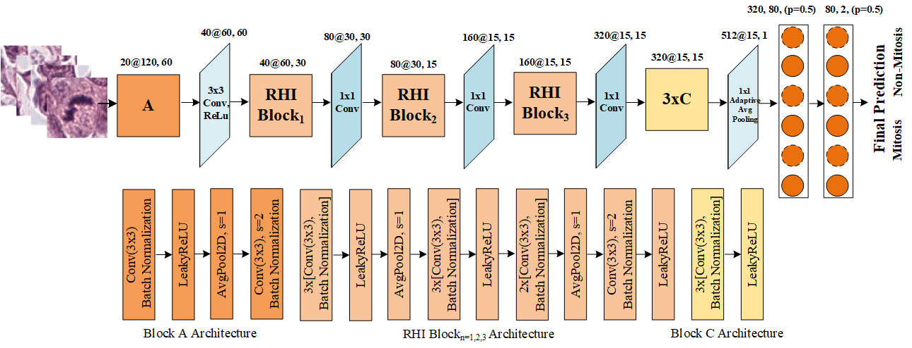
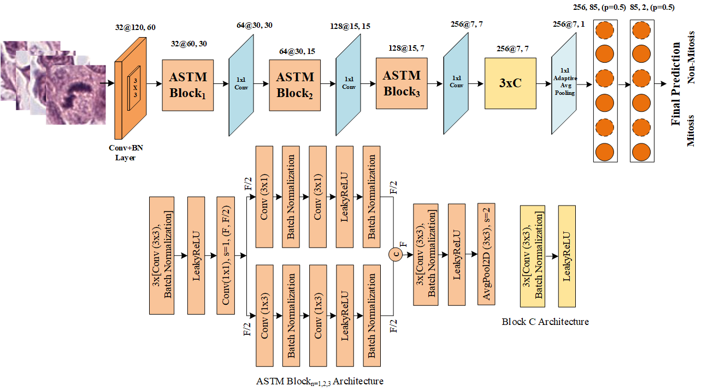
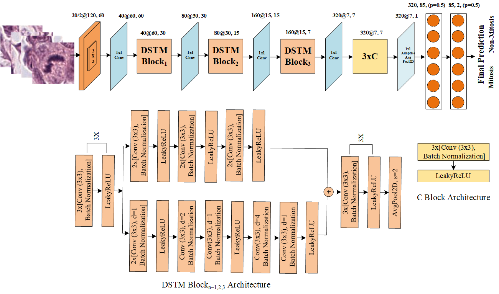
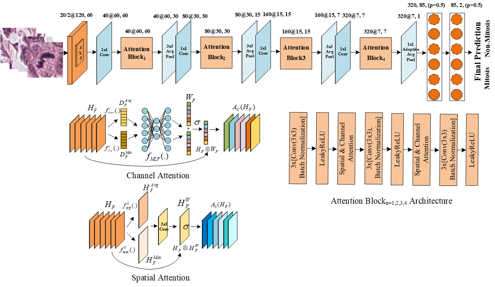
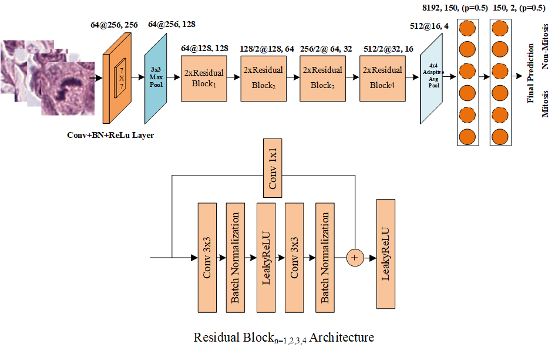

# Mitotic Nuclei Analysis in Breast Cancer Histopathological Images
</b>
This repository is the implementation of paper “Mitotic nuclei analysis in breast cancer histopathology images using deep ensemble classifier” published in Medical Image Analysis, https://doi.org/10.1016/j.media.2021.102121. Experimental details and results are available at https://www.researchgate.net/publication/351988501_Mitotic_Nuclei_Analysis_in_Breast_Cancer_Histopathology_Images_using_Deep_Ensemble_Classifier

## Overview of the Project
</b>

Mitotic  nuclei  estimation  in breast  tumour  samples  has  a  prognostic  significance  in  analysing  tumour aggressiveness and grading system. The automated assessment of mitotic nuclei is challenging because of their  high  similarity  with  non-mitotic  nuclei  and  heteromorphic  appearance.  In  this  work,  we have proposed a  new Deep  Convolutional  Neural  Network  (CNN)  based Heterogeneous Ensemble technique “DHE-Mit-Classifier” for analysis  of  mitotic  nuclei  in breast  histopathology  images. The  proposed technique in  the  first  step detects candidate  mitotic patches from  the  histopathological biopsy  regions, whereas, in  the second step, these  patches  are  classified  into  mitotic  and  non-mitotic  nuclei  using the proposed  DHE-Mit-Classifier.  For the development  of a heterogeneous  ensemble,  five different deep CNNs are designed and used as base-classifiers. These deep CNNs have varying architectural designs to capture  the  structural,  textural,  and  morphological  properties  of  the  mitotic  nuclei.  The  developed  base-classifiers exploit different ideas, including (i) region homogeneity and feature invariance, (ii) asymmetric split-transform-merge, (iii) dilated convolution based multi-scale transformation, (iv) spatial and channel attention, and (v) residual learning. Multi-layer-perceptron is used as a meta-classifier to develop a robust and accurate classifier for providing the final decision. The performance of the proposed ensemble “DHE-Mit-Classifier” is evaluated against state-of-the-art  CNNs.  The  performance  evaluation  on  the  test  set suggests the superiority of the proposed ensemble  with an F-score (0.77), recall (0.71), precision (0.83), and area under the precision-recall curve (0.80). The good generalisation of the proposed ensemble with a considerably high F-score and precision suggests its potential use in the development of an assistance tool for pathologists. The implementation of the proposed technique is provided in this repository.   

 
</b>
Figure 1: Overview of the proposed workflow "DHE-Mit-Classifier".

## Dataset Overview
</b>
Classification and Detection models were trained on  patches of TUPAC16, MITOS12 and MITOS14 and tested on TUPAC16.
</b>
Detection model was used to generate the candidate cells that were verified by the proposed classifier. Dataset distribution was mentioned in https://doi.org/10.1016/j.media.2021.102121.

## Overview of the Proposed CNN Architectures

</b>

</b> Figure 2: Architectural details of the proposed Region Homogeneity and Feature Invariance (RHI) CNN.

</b>

</b> Figure 3: Architectural details of the proposed Asymmetric-Split-Transform-Merge (ASTM) CNN.

</b>

</b> Figure 4: Architectural details of the proposed Dilated based split-transform-merge (DSTM) CNN.

</b>

</b> Figure 5: Architectural details of the proposed Attention based CNN.

</b>

</b> Figure 6: Architectural details of the proposed Residual CNN.

</b>

Figure 7: Architectural details of the proposed Meta-Learner.

## Requirements
</b>

</b>Python = 3.7.3

</b>torch = 1.7.0

</b>torchvision = 0.8.1

## Implementation Details

Trained models are in trained_models directory.

Inference and model definition files are in py_files directory. Load the desired CNN by setting its name in inference file.

## Corresponding Author Details
Prof. Dr. Asifullah Khan,

Department of Computer and Information Sciences (DCIS),

Pakistan Institute of Engineering and Applied Sciences (PIEAS).

Email: asif@pieas.edu.pk

faculty.pieas.edu.pk/asifullah/

## How to cite / More information
Sohail, Anabia, Asifullah Khan, Humaira Nisar, Sobia Tabassum, and Aneela Zameer. "Mitotic Nuclei Analysis in Breast Cancer Histopathology Images using Deep Ensemble Classifier." Medical Image Analysis (2021): 102121.

https://doi.org/10.1016/j.media.2021.102121
https://www.researchgate.net/publication/351988501_Mitotic_Nuclei_Analysis_in_Breast_Cancer_Histopathology_Images_using_Deep_Ensemble_Classifier

